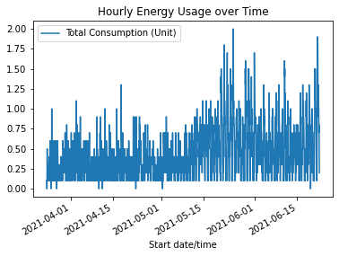
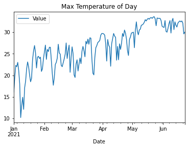
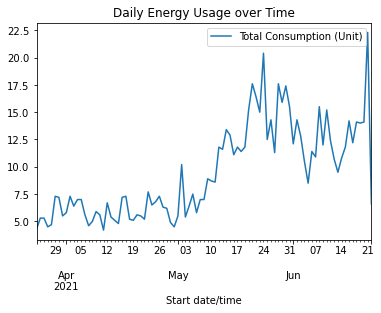
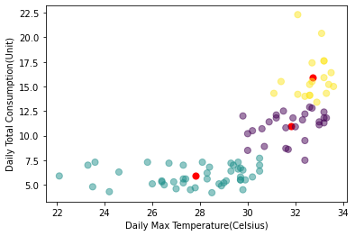
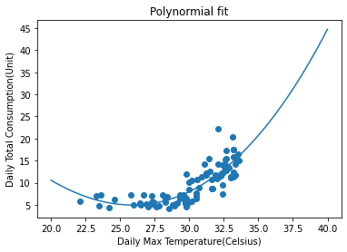

# Introduction
The experiment aim to utilize such resource to analyse electricity usage habit.  A similar work have been done by Kalaiselvi[1] who tried to relate energy consumption to other geographical feature.  This experiment will try to mine my own electric usage to visualize and examine usage habit.

# Data

# Tools
Data Visualization
-	Python 3
-	Pandas 1.2.5
-	Jupyter
-	Matlibplot 3.4.2

Data analysis
-	Python 3
-	Pandas
-	Scikit 0.24.2

Data crawling
-	NodeJS 15.14
-	Objects-to-csv
-	Node-fetch

# Visualization

## Raw Data
  

  

## Grouped Data
  

## Scatter Plot
  

### Clustering (K-means)
  

### Regression (Polynomial)
  
